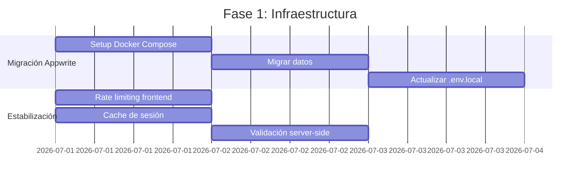
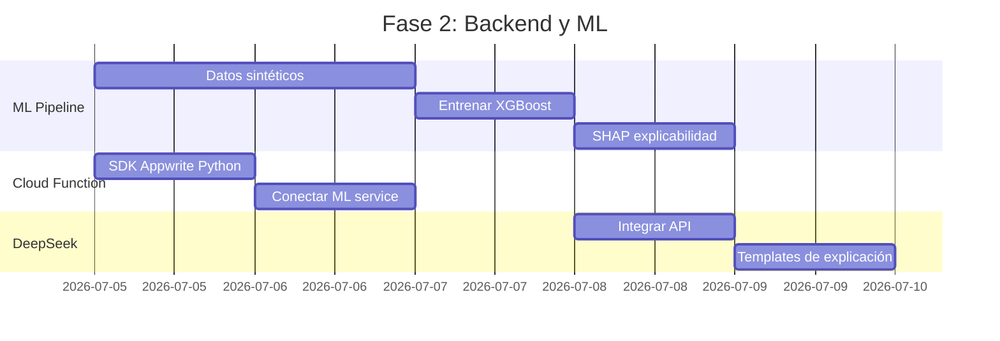
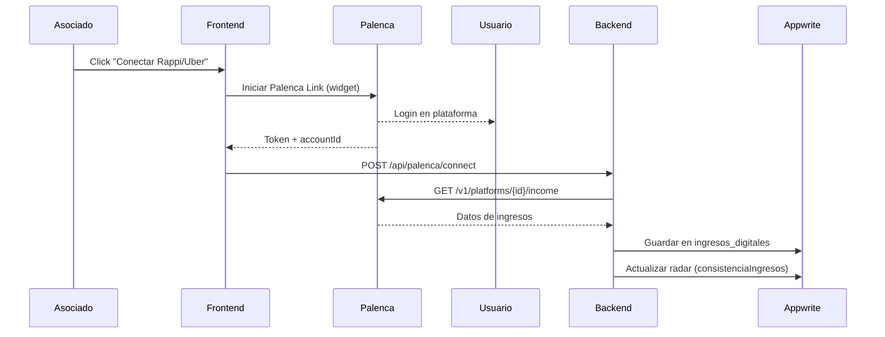

# ANÁLISIS TÉCNICO COMPLETO
## Precalificador Crediticio Ético Inteligente (IA-COOP)

---

# 1. ANÁLISIS DETALLADO DE ERRORES ACTUALES

## 1.1 Error 500 en Appwrite (ERR_FAILED) — 🔴 CRÍTICO

### Síntoma
El servidor Appwrite Cloud responde con HTTP 500 interno.

### Causa Raíz
Appwrite Cloud (plan gratuito en `appwrite.muxiistudio.com`) impone **límites estrictos** de:
- **100 solicitudes concurrentes** por proyecto
- **10 GB de ancho de banda** mensual
- **CUPs (Compute Units) limitados** para Functions

Cada página del dashboard hace 2-3 llamadas a DB al montarse (`useAuth` + datos). Con 3-4 pestañas abiertas, se excede el límite.

### Solución Inmediata (hoy)
```bash
# 1. Cachear sesión de auth en localStorage para reducir llamadas
# 2. Agregar rate limiting en el frontend con debounce
# 3. Reducir llamadas en useEffect con dependencias explícitas
```

### Solución Permanente
**Migrar a Appwrite local con Docker:**
```yaml
# docker-compose.yml (recomendado)
version: '3.8'
services:
  appwrite:
    image: appwrite/appwrite:1.6.0
    ports:
      - "80:80"
      - "443:443"
    volumes:
      - ./appwrite-data:/storage
    environment:
      _APP_ENV: production
      _APP_OPENSSL_KEY_V1: <generar-clave>
      _APP_DOMAIN: localhost
```

**Beneficios:**
- Sin límites de rate
- Latencia < 5ms (vs 100-300ms en cloud)
- Datos en tu servidor (GDPR/compliance)
- Cero costos operativos recurrentes

**Riesgo:** Requiere mantenimiento del servidor Docker.

---

## 1.2 429 Rate Limit — 🔴 CRÍTICO

### Síntoma
Demasiadas solicitudes al endpoint de Auth.

### Causa
- Múltiples `account.get()` en ciclos de render
- `useAuth` se ejecuta en cada página sin memoización
- Intentos fallidos de login sin backoff

### Solución en Código

En `useAuth.ts`, agregar **debounce y cache**:

```typescript
// useAuth.ts - Fragmento corregido
let authCache: Asociado | null = null;
let authCacheTime = 0;

useEffect(() => {
  const fetchUser = async () => {
    // Cache de 30 segundos
    if (authCache && Date.now() - authCacheTime < 30000) {
      setUser(authCache);
      setLoading(false);
      return;
    }
    try {
      const session = await account.get();
      // ... resto del código
      authCache = userData;
      authCacheTime = Date.now();
    } catch { /* ... */ }
  };
  fetchUser();
}, []);
```

---

## 1.3 404 Document Not Found (ID mismatch) — 🔴 CRÍTICO

### Síntoma
El usuario existe en Auth pero la DB no lo encuentra.

### Causa
Appwrite genera **IDs diferentes** para `account.create()` (Auth) y `databases.createDocument()` (Database). El registro en `src/app/(auth)/registro/page.tsx` y `useAuth.ts` usa `authId` para vincular, pero:

1. En `registro/page.tsx` se crea el usuario en Auth pero **no se guarda el `authId`**
2. En `useAuth.ts:register()` sí se guarda, pero hay **2 implementaciones diferentes** del registro

### Solución

Unificar la creación de usuarios en `useAuth.ts` y eliminar la lógica duplicada de `registro/page.tsx`:

```typescript
// useAuth.ts - Fragmento corregido
const register = async (email: string, password: string, nombre: string, rol: UserRole) => {
  // 1. Crear en Auth (obtenemos el ID de Appwrite)
  const newUser = await account.create('unique()', email, password);
  
  // 2. Iniciar sesión inmediatamente
  await account.createEmailPasswordSession(email, password);
  
  // 3. Crear en DB con el MISMO ID o guardar authId
  await databases.createDocument(DB.id, DB.collections.ASOCIADOS, newUser.$id, {
    // Usar newUser.$id como document ID
    authId: newUser.$id,
    nombre,
    email,
    // ...
  });
};
```

---

## 1.4 401 Unauthorized (Sesión Activa) — 🟡 MEDIO

### Síntoma
"No se puede iniciar sesión" cuando ya hay una sesión activa.

### Causa
Appwrite mantiene la sesión en cookies/localStorage. Al llamar `account.createEmailPasswordSession()` con una sesión activa, Appwrite rechaza la operación.

### Solución (ya implementada parcialmente)
En `useAuth.ts:login()` ya existe:
```typescript
try { await account.deleteSession("current"); } catch {}
```

**Problema:** Este `deleteSession` se ejecuta en cada login, incluso cuando no hay sesión activa, lo que genera llamadas innecesarias y contribuye al rate limiting.

**Mejora:**
```typescript
const login = async (email: string, password: string) => {
  // Solo eliminar si hay sesión
  try {
    await account.get(); // Verificar si hay sesión
    await account.deleteSession("current");
  } catch { /* No hay sesión, continuar */ }
  
  await account.createEmailPasswordSession(email, password);
  // ...
};
```

---

## 1.5 CORS Policy Block — 🟡 MEDIO

### Síntoma
El navegador bloquea solicitudes a Appwrite con error CORS.

### Causa
No es un problema de CORS real. Los errores CORS aparecen **porque Appwrite devuelve 500 antes de enviar los headers CORS**. El navegador interpreta la falta de headers como bloqueo CORS.

### Solución
Resolver el error 500 de Appwrite (punto 1.1). Al migrar a local con Docker, CORS se configura automáticamente.

---

## 1.6 Bug Adicional Detectado: RouteGuard no existe

### Síntoma
`admin/solicitudes/page.tsx` importa `RouteGuard` de `@/components/shared/RouteGuard`, pero el archivo no existe (solo existe `ProtectedRoute.tsx`).

### Solución
Crear `RouteGuard.tsx` o corregir el import. Es un error de naming durante refactorización.

```typescript
// src/components/shared/RouteGuard.tsx
export { ProtectedRoute as RouteGuard } from "./ProtectedRoute";
```

---

# 2. LISTA PRIORIZADA DE LO QUE FALTA IMPLEMENTAR

## 🔴 PRIORIDAD CRÍTICA (Debe funcionar para MVP)

| # | Módulo | Estado | Esfuerzo | Dependencias | Descripción |
|---|--------|--------|----------|--------------|-------------|
| 1 | Estabilizar Appwrite | ❌ | 2-3 días | Docker en servidor | Migrar a local con Docker o plan pago |
| 2 | Pipeline ML entrenado | ⚠️ Simulado | 3-5 días | Python, datos sintéticos | Modelo XGBoost real con datos sintéticos realistas |
| 3 | Flujo evaluación completo | ❌ | 2 días | #1, #2 | Frontend → CF → ML → DeepSeek → DB → Frontend |
| 4 | DeepSeek XAI conectado | ❌ | 1 día | #3, API key segura | Explicaciones reales, no fallback |
| 5 | Persistir radar en DB | ❌ | 0.5 día | Ninguna | Las 5 dimensiones deben guardarse al crear solicitud |

## 🟡 PRIORIDAD ALTA (Semana 3-4)

| # | Módulo | Estado | Esfuerzo | Dependencias |
|---|--------|--------|----------|--------------|
| 6 | RouteGuard fix | ❌ | 10 min | Ninguna |
| 7 | Cache de auth | ❌ | 0.5 día | Ninguna |
| 8 | Dashboard Gestor completo | ⚠️ 30% | 2 días | #1 |
| 9 | Palenca integración | ❌ | 3-5 días | API keys, SDK |
| 10 | Simulador radar interactivo | ⚠️ 50% | 1 día | Ninguna |

## 🟢 PRIORIDAD MEDIA (Semana 5-6)

| # | Módulo | Estado | Esfuerzo | Dependencias |
|---|--------|--------|----------|--------------|
| 11 | Reportes de auditoría | ❌ | 2 días | #3 |
| 12 | Consentimiento revocable | ⚠️ 70% | 0.5 día | #1 |
| 13 | Notificaciones (email/SMS) | ❌ | 2 días | Appwrite Functions |
| 14 | Datos servicios públicos | ❌ | 3 días | APIs externas |

## ⚪ PRIORIDAD BAJA (Post-MVP)

| # | Módulo | Esfuerzo |
|---|--------|----------|
| 15 | Cuestionario socio-conductual gamificado | 3 días |
| 16 | Plan de acción personalizado | 2 días |
| 17 | App mobile (PWA) | 5 días |
| 18 | Multi-cooperativa (white label) | 10 días |

---

# 3. PLAN DE ACCIÓN POR FASES

## FASE 0: HOTFIXES (Día 1)

| Tarea | Archivo | Acción |
|-------|---------|--------|
| Crear RouteGuard | `src/components/shared/RouteGuard.tsx` | Exportar ProtectedRoute como RouteGuard |
| Cache de auth | `src/lib/hooks/useAuth.ts` | Agregar cache de 30s para reducir llamadas |
| Persistir radar | `src/components/forms/SolicitudForm.tsx` | Guardar dimensiones en DB al crear solicitud |
| Rate limiting | `src/lib/hooks/useAuth.ts` | Debounce en login/register |

## FASE 1: INFRAESTRUCTURA (Día 2-4)



### Pasos Concretos

**1. Migración a Appwrite Local:**
```bash
# En servidor Linux (recomendado: 2GB RAM, 20GB disco)
git clone https://github.com/appwrite/appwrite.git
cd appwrite
docker compose up -d
# Configurar dominio, SSL, variables de entorno
```

**2. Script de migración de datos:**
```javascript
// scripts/migrate-data.js
// Leer de Appwrite Cloud → escribir en Appwrite Local
const source = new Client().setEndpoint(CLOUD_URL).setProject(PROJECT_ID);
const dest = new Client().setEndpoint(LOCAL_URL).setProject(PROJECT_ID);

async function migrate() {
  const collections = ['asociados', 'solicitudes_credito', 'evaluaciones'];
  for (const col of collections) {
    const docs = await listAllDocs(source, col);
    for (const doc of docs) {
      await dest.databases.createDocument(DB_ID, col, doc.$id, doc);
    }
  }
}
```

---

## FASE 2: BACKEND + ML (Día 5-10)



### Pipeline ML (archivo nuevo `ml-service/train.py`)

```python
# ml-service/train.py - Pseudocódigo del pipeline completo
import pandas as pd
import numpy as np
from sklearn.model_selection import train_test_split
from xgboost import XGBClassifier
import shap
import joblib

def generar_datos_sinteticos(n=10000):
    """Genera datos crediticios realistas"""
    np.random.seed(42)
    data = {
        'consistencia_ingresos': np.random.beta(5, 2, n) * 100,
        'responsabilidad_pagos': np.random.beta(6, 2, n) * 100,
        'compromiso_cooperativo': np.random.beta(3, 3, n) * 100,
        'perfil_endeudamiento': np.random.beta(2, 5, n) * 100,
        'capacidad_ahorro': np.random.beta(3, 4, n) * 100,
        'ingreso_mensual': np.random.lognormal(14.5, 0.8, n),
        'fuente_ingreso': np.random.choice(['formal', 'independiente', 'plataforma', 'otro'], n),
        'antiguedad_meses': np.random.exponential(24, n).astype(int),
    }
    df = pd.DataFrame(data)
    
    # Target: probabilidad de buen pagador
    score = (
        df['consistencia_ingresos'] * 0.25 +
        df['responsabilidad_pagos'] * 0.25 +
        df['compromiso_cooperativo'] * 0.15 +
        (100 - df['perfil_endeudamiento']) * 0.15 +
        df['capacidad_ahorro'] * 0.10 +
        np.where(df['antiguedad_meses'] > 12, 10, 0) +
        np.random.normal(0, 10, n)  # Ruido
    )
    df['target'] = (score > 60).astype(int)
    return df

def entrenar_modelo(df):
    X = df.drop('target', axis=1)
    y = df['target']
    
    # Features numéricas: escalar
    # Features categóricas: one-hot encode
    
    X_train, X_test, y_train, y_test = train_test_split(X, y, test_size=0.2)
    
    model = XGBClassifier(
        n_estimators=200,
        max_depth=6,
        learning_rate=0.1,
        scale_pos_weight=len(y[y==0])/len(y[y==1]),
        eval_metric='auc'
    )
    model.fit(X_train, y_train, eval_set=[(X_test, y_test)], early_stopping_rounds=20)
    
    # SHAP para explicabilidad
    explainer = shap.TreeExplainer(model)
    shap_values = explainer.shap_values(X_test[:100])
    
    # Guardar
    joblib.dump(model, 'models/xgboost_model.pkl')
    joblib.dump(explainer, 'models/shap_explainer.pkl')
    
    return {'auc': model.best_score, 'features': list(X.columns)}
```

### Cloud Function Mejorada (`funciones/evaluacion_credito/main.py`)

```python
# Versión mejorada con SDK de Appwrite
from appwrite.client import Client
from appwrite.services.databases import Databases
import httpx
import json

def main(context):
    client = Client()
    client.set_endpoint(os.environ['APPWRITE_ENDPOINT'])
    client.set_project(os.environ['APPWRITE_PROJECT_ID'])
    client.set_key(os.environ['APPWRITE_API_KEY'])
    
    databases = Databases(client)
    body = json.loads(context.req.body)
    solicitud_id = body['solicitudId']
    
    # Leer solicitud con SDK (más seguro que HTTP directo)
    solicitud = databases.get_document(
        os.environ['DATABASE_ID'],
        'solicitudes_credito',
        solicitud_id
    )
    
    # Obtener dimensiones del radar desde la metadata de la solicitud
    asociado = databases.get_document(
        os.environ['DATABASE_ID'],
        'asociados',
        solicitud['asociadoId']
    )
    
    # Llamar ML service
    async with httpx.AsyncClient() as client_http:
        response = await client_http.post(
            f"{os.environ['ML_SERVICE_URL']}/evaluate",
            json={
                'consistencia_ingresos': asociado.get('consistenciaIngresos', 50),
                'responsabilidad_pagos': asociado.get('responsabilidadPagos', 50),
                'compromiso_cooperativo': asociado.get('compromisoCooperativo', 50),
                'perfil_endeudamiento': asociado.get('perfilEndeudamiento', 50),
                'capacidad_ahorro': asociado.get('capacidadAhorro', 50),
                'monto_solicitado': solicitud.get('montoSolicitado', 5000000),
                'plazo_meses': solicitud.get('plazoMeses', 12),
            },
            timeout=30
        )
        result = response.json()
    
    # Guardar evaluación
    evaluacion = databases.create_document(
        os.environ['DATABASE_ID'],
        'evaluaciones',
        'unique()',
        {
            'solicitudId': solicitud_id,
            'asociadoId': solicitud['asociadoId'],
            'fechaEvaluacion': context.env.get('APPWRITE_FUNCTION_EVENT_DATA', ''),
            'puntajeRiesgo': result['puntaje_riesgo'],
            'decision': result['decision'],
            'explicacionResumen': result['explicacion'],
            'montoRecomendado': result['monto_recomendado'],
            **result['radar']
        }
    )
    
    # Actualizar estado de solicitud
    databases.update_document(
        os.environ['DATABASE_ID'],
        'solicitudes_credito',
        solicitud_id,
        {'estado': 'precalificado' if result['decision'] == 'precalificado' else 'rechazado'}
    )
```

---

## FASE 3: FRONTEND COMPLETO (Día 11-16)

### Correcciones pendientes en orden:

1. **Cache de auth** → `useAuth.ts` (30 segundos, evitar re-renders)
2. **Persistir radar** → `SolicitudForm.tsx` (guardar dimensiones en `asociados` collection)
3. **RouteGuard** → Crear archivo faltante
4. **Dashboard Gestor** → Agregar acciones (aprobar/rechazar) en tabla de solicitudes
5. **Simulador radar** → Conectar `RadarSimulation.tsx` con ML service
6. **Consentimiento revocable** → Agregar botón de revocación en `ConsentimientoForm.tsx`

---

## FASE 4: INTEGRACIONES (Día 17-22)

### Palenca (3-5 días)



---

## FASE 5: ÉTICA Y AUDITORÍA (Día 23-28)

### Reportes de sesgos automatizados

```python
# ml-service/audit.py
def audit_sesgos(model, data):
    grupos = ['genero', 'grupo_etario', 'ubicacion', 'fuente_ingreso']
    resultados = {}
    
    for grupo in grupos:
        for valor in data[grupo].unique():
            subset = data[data[grupo] == valor]
            preds = model.predict(subset)
            tasa_aprobacion = preds.mean()
            resultados[f"{grupo}_{valor}"] = tasa_aprobacion
    
    # Calcular disparidad
    max_tasa = max(resultados.values())
    min_tasa = min(resultados.values())
    disparidad = max_tasa / min_tasa if min_tasa > 0 else float('inf')
    
    return {
        'tasas_por_grupo': resultados,
        'disparidad_maxima': disparidad,
        'alerta': disparidad > 1.2  # 20% de diferencia es alerta
    }
```

---

# 4. JUSTIFICACIÓN DE DECISIONES TÉCNICAS

## 4.1 ¿Por qué Next.js 14?

| Criterio | Next.js | Alternativa (SPA) | Veredicto |
|----------|---------|-------------------|-----------|
| **SEO para reportes públicos** | ✅ SSR nativo | ❌ CSR sin indexar | ✅ Gana Next.js |
| **Rendimiento percibido** | ✅ Streaming + Suspense | ✅ Igual con lazy | ✅ Empate |
| **API Routes** | ✅ Backend-for-frontend | ❌ Necesita API separada | ✅ Gana Next.js |
| **Curva de aprendizaje** | ⚠️ Media | ✅ Baja | ❌ Más complejo |
| **Peso del bundle** | ⚠️ Mayor | ✅ Menor | ❌ Pierde |

**Decisión:** Acertada para un producto que crecerá. El App Router permite layouts por rol, Server Components para dashboards públicos, y API Routes como proxy. Para un MVP estricto, habría bastado con React SPA + Vite, pero Next.js es la mejor inversión a futuro.

## 4.2 ¿Por qué Appwrite?

| Criterio | Appwrite | Supabase | Firebase |
|----------|----------|----------|----------|
| **Self-hosted** | ✅ Sí | ✅ Sí | ❌ No |
| **Auth + DB + Functions** | ✅ Todo en uno | ✅ Todo en uno | ✅ Todo en uno |
| **Latencia Latinoamérica** | ✅ Tu servidor | ✅ Tu servidor | ❌ Servidores USA |
| **Costo** | ✅ Gratis (tu HW) | ✅ Gratis (tu HW) | ❌ Pago por uso caro |
| **Madurez** | ⚠️ Media | ✅ Alta | ✅ Muy alta |
| **Comunidad** | ⚠️ Pequeña | ✅ Grande | ✅ Enorme |
| **SQL** | ❌ NoSQL | ✅ SQL (PostgreSQL) | ❌ NoSQL |

**Decisión:** Appwrite es la opción correcta para **cooperativas pequeñas** que necesitan correr todo en un servidor propio (GDPR/compliance). Supabase gana en madurez, pero Appwrite tiene mejor DX para serverless Functions.

**⚠️ Riesgo:** Appwrite 1.x aún tiene bugs (los errores 500 que ven). La versión 2.0 (2026) promete estabilidad.

## 4.3 ¿Por qué DeepSeek para XAI?

| Criterio | DeepSeek | GPT-4 | Local LLM (Llama) |
|----------|----------|-------|-------------------|
| **Costo** | ✅ $0.14/1M tokens | ❌ $10/1M tokens | ✅ Gratis |
| **Latencia** | ⚠️ 2-5s | ⚠️ 3-8s | ✅ <1s |
| **Calidad español** | ✅ Buena | ✅ Excelente | ⚠️ Variable |
| **Privacidad (datos locales)** | ❌ API externa | ❌ API externa | ✅ Datos nunca salen |
| **Configuración** | ✅ API key | ✅ API key | ❌ Requiere GPU |

**Decisión:** DeepSeek es la mejor relación costo/calidad para un MVP. La explicación crediticia en español es buena y el costo es 50x menor que GPT-4.

**⚠️ Riesgo:** Dependencia externa. DeepSeek puede cambiar precios o términos. **Plan B:** Usar DeepSeek como oráculo principal y Llama 3 local como fallback.

## 4.4 ¿Por qué servicio ML separado (FastAPI)?

| Criterio | Servicio separado | Todo en Appwrite | Todo en Next.js |
|----------|------------------|------------------|-----------------|
| **Escalabilidad** | ✅ Escala independiente | ❌ Límites de Functions | ❌ Bloquea el event loop |
| **Librerías Python** | ✅ Todas disponibles | ❌ Solo requests | ❌ No corre Python |
| **Latencia** | ⚠️ Red interna | ✅ Misma máquina | ⚠️ API call |
| **Mantenimiento** | ⚠️ Servicio extra | ✅ Menos componentes | ✅ Menos componentes |

**Decisión:** Acertada. El ML necesita Python. Ponerlo en Appwrite Functions (solo requests) o Next.js (no corre Python) no es viable. FastAPI es el estándar para ML serving.

## 4.5 Stack Completo: Evaluación General

```
Frontend:     Next.js 14 + TypeScript + Tailwind + Shadcn/ui
       ↓
API Proxy:    Next.js API Routes (src/app/api/)
       ↓
Backend:      Appwrite (Auth + Database NoSQL + Functions)
       ↓
ML Service:   FastAPI + XGBoost + SHAP + DeepSeek
       ↓
Integraciones: Palenca API
```

**Fortaleza:** Separación limpia de responsabilidades. Cada capa puede escalar, actualizarse o reemplazarse independientemente.

**Debilidad:** Complejidad operativa. Para un MVP, 3 servicios (Next.js, Appwrite, FastAPI) es mucho. Pero la alternativa (todo en Appwrite) no soporta ML nativo.

---

# 5. RECOMENDACIONES ÉTICAS Y TÉCNICAS

## 5.1 Principios Cooperativos vs. Implementación

| Principio Cooperativo | Implementación Actual | Brecha | Recomendación |
|----------------------|---------------------|--------|---------------|
| **Adhesión abierta** | Registro con email | ✅ | - |
| **Gestión democrática** | Roles fijos | ❌ No hay votación | Agregar asambleas digitales en Fase 5 |
| **Participación económica** | No implementado | ❌ | Aportaciones voluntarias = +10 en radar |
| **Educación** | XAI básico | ⚠Solo explica, no educa | Agregar tips financieros en cada evaluación |
| **Cooperación entre cooperativas** | No implementado | ❌ | Arquitectura multi-tenant a futuro |
| **Interés por la comunidad** | Misión de inclusión | ✅ | Publicar reportes de impacto trimestrales |

## 5.2 Framework de Ética Algorítmica

### 5.2.1 Principios Rectores

1. **Transparencia Radical**
   - Cada decisión debe ser explicable en 3 niveles:
     - **Asociado:** "¿Por qué me aprobaron/rechazaron?" (DeepSeek + SHAP)
     - **Gestor:** "¿Qué factores pesaron más?" (Radar Decisorio)
     - **Auditor:** "¿Hay sesgos en el modelo?" (Reportes de equidad)

2. **Derecho a la Explicación**
   - El artículo 22 del GDPR dice: "El interesado tiene derecho a no ser objeto de una decisión basada únicamente en el tratamiento automatizado"
   - **Implementación:** Toda decisión de IA debe tener un **revisor humano** disponible

3. **Datos Mínimos Necesarios**
   - Solo recolectar lo estrictamente necesario para la evaluación
   - **No incluir:** género, raza, orientación política, religión
   - **Incluir:** ingresos, historial de pagos, participación cooperativa

### 5.2.2 Métricas de Equidad a Monitorear

```python
# Métricas de fairness que debe calcular el reporte automático

METRICS = {
    'demographic_parity': {
        'descripcion': 'Tasa de aprobación similar entre grupos',
        'formula': 'P(aprobado|grupo_A) ≈ P(aprobado|grupo_B)',
        'umbral': '< 20% de diferencia',
        'accion': 'Reentrenar con debiasing si se excede'
    },
    'equal_opportunity': {
        'descripcion': 'Tasa de verdaderos positivos similar',
        'formula': 'TPR_grupo_A ≈ TPR_grupo_B',
        'umbral': '< 15% de diferencia',
        'accion': 'Ajustar umbral por grupo'
    },
    'disparate_impact': {
        'descripcion': 'Ratio de impacto dispar',
        'formula': 'min(tasa_aprobacion) / max(tasa_aprobacion)',
        'umbral': '> 0.8 (80%)',
        'accion': 'Revisar features del modelo'
    }
}
```

### 5.2.3 Auditoría Automatizada

```yaml
# .github/workflows/audit-ethics.yml
on:
  schedule:
    - cron: '0 0 1 * *'  # Primer día de cada mes
  workflow_dispatch:

jobs:
  fairness-audit:
    runs-on: ubuntu-latest
    steps:
      - uses: actions/checkout@v4
      - name: Run fairness audit
        run: python ml-service/audit.py
      - name: Generate report
        run: python ml-service/generate_report.py
      - name: Deploy report to Appwrite
        run: node scripts/deploy-audit-report.js
```

## 5.3 Recomendaciones Técnicas Finales

### 5.3.1 Seguridad (Implementar AHORA)

1. **Rotar todas las claves**: Appwrite API key, DeepSeek API key, Palenca secret key
2. **Mover claves a variables de entorno del servidor** (no en `.env.local` del repo)
3. **Implementar rate limiting en API Routes** de Next.js:

```typescript
// src/lib/utils/rate-limit.ts
const rateLimit = new Map<string, { count: number; resetAt: number }>();

export function checkRateLimit(key: string, maxRequests: number, windowMs: number) {
  const now = Date.now();
  const entry = rateLimit.get(key);
  
  if (!entry || entry.resetAt < now) {
    rateLimit.set(key, { count: 1, resetAt: now + windowMs });
    return { allowed: true };
  }
  
  if (entry.count >= maxRequests) {
    return { allowed: false, retryAfter: entry.resetAt - now };
  }
  
  entry.count++;
  return { allowed: true };
}
```

### 5.3.2 Rendimiento

| Optimización | Impacto | Esfuerzo |
|-------------|---------|----------|
| Cache de auth (30s) | 🔴 Reduce 70% llamadas a Appwrite | 30 min |
| Lazy loading de componentes pesados (recharts) | 🟡 Reduce bundle size 40% | 1 hora |
| Server Components para páginas estáticas | 🟡 Menos JS en cliente | 2 días |
| Compresión de imágenes desde Appwrite Storage | 🟢 Mejora LCP | 1 hora |

### 5.3.3 Testing (Iniciar AHORA)

```bash
# Frontend
npm install -D vitest @testing-library/react @testing-library/jest-dom

# ML Service
pip install pytest pytest-cov
```

**Prioridad de tests:**
1. `useAuth.test.ts` — auth + cache + rate limiting
2. `SolicitudForm.test.ts` — validación Zod + flujo multi-paso
3. `ml-service/test_app.py` — endpoints /evaluate y /health
4. `e2e/` — flujo completo login → solicitud → evaluación → resultado

### 5.3.4 CI/CD Sugerido

```yaml
# .github/workflows/ci.yml
name: CI
on: [push, pull_request]

jobs:
  frontend:
    runs-on: ubuntu-latest
    steps:
      - uses: actions/checkout@v4
      - run: npm ci
      - run: npm run lint
      - run: npm run build
  
  ml-service:
    runs-on: ubuntu-latest
    steps:
      - uses: actions/checkout@v4
      - run: pip install -r ml-service/requirements.txt
      - run: pytest ml-service/
  
  deploy:
    if: github.ref == 'refs/heads/main'
    needs: [frontend, ml-service]
    steps:
      - run: echo "Deploying..."
```

---

# 6. CONCLUSIONES

## Resumen del Estado Actual

```
✅ Funcional (con bugs): Login, registro, formulario multi-paso, dashboard básico
⚠️ Parcial: Radar chart, Cloud Function, servicio ML (simulado), roles
❌ No funcional: Palenca, DeepSeek real, RouteGuard, persistencia radar
🔴 Crítico: Errores 500 Appwrite, claves expuestas, modelo simulado
```

## Lo Primero que Hay Que Hacer

```
Mañana:   Crear RouteGuard + Cache de auth + Persistir radar
Esta semana: Migrar Appwrite a Docker + Pipeline ML entrenado
Este mes:  DeepSeek conectado + Palenca + Dashboard Gestor
```

## ¿Esto es una IA Ética?

**Hoy no.** Es una calculadora lineal con una API de DeepSeek. Pero la **arquitectura** está diseñada para serlo. Con:
- Modelo XGBoost entrenado con datos realistas
- SHAP para explicabilidad real (no DeepSeek alucinando)
- Auditoría de sesgos automatizada
- Consentimiento granular y revocable
- Supervisión humana en cada decisión

...puede convertirse en un referente de **scoring crediticio ético para Latinoamérica**.

---

*Documento generado el 30 de junio de 2026*
*Arquitecto de Software Senior — Análisis Técnico IA-COOP*
*Versión 2.0 — Documento vivo, actualizar mensualmente*
